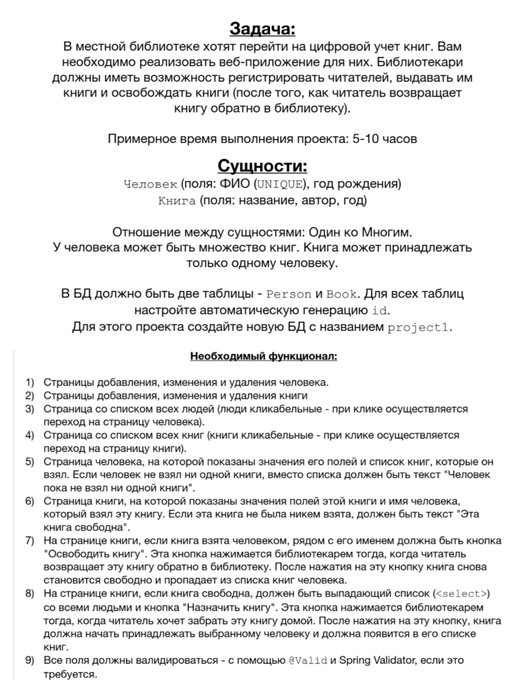

# spring-projects
Я прошел курс [Spring - Полный курс. Boot, Hibernate, Security, REST](https://swiftbook.org/courses/438/show_promo/), преподаватель Наиль Алишев, платформа swiftbook.org. В этом репозитории, проекты выполненные в ходе прохождения курса.
## project1

---

Функционал реализован в полном объеме.

Приложэение устанавливается на Apache Tomcat 10.1.16, разворачивается по контекстному пути http://localhost:8080/library

Использованные технологии: Java 17 SE, Apache Maven, Apache Tomcat, PostgreSQL, JDBC, Spring Core, Spring MVC, HTML, CSS.

---
